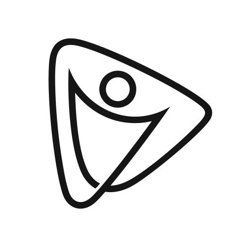

<h1 align="center">Watchoble 📺</h1>
<a id="readme-top"></a>

[![Contributors][contributors-shield]][contributors-url]
[![Forks][forks-shield]][forks-url]
[![Stargazers][stars-shield]][stars-url]
[![Issues][issues-shield]][issues-url]
[](https://github.com/kiloumanjaro/Watchoble/blob/main/LICENSE)
[![LinkedIn][linkedin-shield]][linkedin-url]

<!-- PROJECT LOGO -->

<div align="center">
  <br />
  <a href="https://github.com/kiloumanjaro/Watchoble">
    
  </a>
  <br />
  <p align="center">
    <br />
    Track shows & discover like an <em>Iskolar ng Bayan</em>
    <br />
    <br />
    <p align="center">
      <a href="#"></a>
      <a href="https://www.figma.com/design/Wphx1EKR0eY2Io0gokTvyn/ThriftNotice?node-id=0-1&t=GhaLetxFdu1aiIcZ-1"></a>
      <a href="https://www.python.org"></a>
      <a href="https://github.com/kiloumanjaro/Watchoble/commits/main">
    </p>
    <a href="https://github.com/kiloumanjaro/Watchoble/issues/new?labels=bug&template=bug-report---.md">Report Bug</a>
    &middot;
    <a href="https://github.com/kiloumanjaro/Watchoble/issues/new?labels=enhancement&template=feature-request---.md">Request Feature</a>
  </p>
</div>

<!-- TABLE OF CONTENTS -->
<details>
  <summary>Table of Contents</summary>
  <ol>
    <li>
      <a href="#-project-overview">📝 Project Overview</a>
      <ul>
        <li><a href="#--built-with">🧱  Built With</a></li>
      </ul>
    </li>
    <li><a href="#-features">📱 Screenshots</a></li>
    <li>
      <a href="#-getting-started">🚀 Getting Started</a>
      <ul>
        <li><a href="#-prerequisites">🔧 Prerequisites</a></li>
        <li><a href="#%EF%B8%8F-installation">🛠️ Installation</a></li>
        <li><a href="#%EF%B8%8F-running-the-application">▶️ Running</a></li>
      </ul>
    </li>
    <li><a href="#-notes">📝 Notes</a></li>
    <li><a href="#-contributing">📬 Contributing</a></li>
    <li><a href="#%EF%B8%8F-license">⚖️ License</a></li>
  </ol>
</details>

<!-- PROJECT OVERVIEW -->

## 📝 Project Overview

This project is a modern watchlist app for tracking movies and TV shows you want to watch, are watching, or have finished. Its name, inspired by the [*Oble*](https://en.wikipedia.org/wiki/Oblation_(statue)) of the University of the Philippines, reflects the creators' roots and their commitment to building meaningful, user-friendly tools.

### 🧱  Built With

[![Expo][Expo]][Expo-url]
[![Node.js][Node.js]][Node.js-url]
[![React Native][React-Native]][React-Native-url]
[![TypeScript][TypeScript]][TypeScript-url]
[![TailwindCSS][Tailwind]][Tailwind-url]
[![Supabase][Supabase]][Supabase-url]

## 📱 Features

> _For more examples, please refer to the [Documentation](https://www.canva.com/design/DAGpUpNFjQU/L76Qn5GYrCd-QALyc0Armg/view?utm_content=DAGpUpNFjQU&utm_campaign=designshare&utm_medium=link2&utm_source=uniquelinks&utlId=h646d3d276a)_

<div style="display: flex; gap: 10px; align-items: flex-start;">
  
  
  
  

  
  
  
  
  

</div>

## 🚀 Getting Started

Follow these steps to get Watchoble running on your local machine.

> [!IMPORTANT]
> 
> The app uses [The Movie Database (TMDb)](https://developer.themoviedb.org/docs/getting-started) and you must sign up to get an API Key

### 🔧 Prerequisites

- Node.js (v16.0.0 or higher)
- Expo Go
- npm or yarn

### 🛠️ Installation

#### 1. Clone the Repository

```sh
git clone https://github.com/kiloumanjaro/Watchoble.git
cd Watchoble
```

#### 2. Install Dependencies

```sh
# Install project dependencies
npm install
```

#### 3. Environment Setup

```bash
# Copy the environment template
cp .env.example .env
```

Edit the `.env` file with your configuration (API keys, database URL, etc.)

### ▶️ Running the Application

```sh
npx expo start
```

> [!WARNING]
> 
> The app is built on [SDK 52](https://expo.dev/blog/upgrading-to-expo-sdk-52) and will not work on other versions

## 📝 Notes

- Make sure you have the Expo CLI installed globally: `npm install -g @expo/cli`
- Use the Expo Go app to scan the QR code and test on your mobile device (ensure same Wi-Fi network)
- You can also use an Android emulator (via Android Studio) or an iOS Simulator (requires Xcode)
- Clear the Expo cache if you encounter issues: `expo start --clear`

## 📬 Contributing

If you have a suggestion that would make this better, please fork the repo and create a pull request. You can also simply open an issue with the tag "enhancement".
Don't forget to give the project a star! Thanks again!

1. Fork the Project
2. Create your Feature Branch (`git checkout -b feature/AmazingFeature`)
3. Commit your Changes (`git commit -m 'Add some AmazingFeature'`)
4. Push to the Branch (`git push origin feature/AmazingFeature`)
5. Open a Pull Request

### 📢 Contributors

<a href="https://github.com/kiloumanjaro/Watchoble/graphs/contributors">
  
</a>

## ⚖️ License

This project is licensed under the Apache-2.0 License - see the [LICENSE](LICENSE) file for details.

<!-- MARKDOWN LINKS & IMAGES -->

[contributors-shield]: https://img.shields.io/github/contributors/kiloumanjaro/Watchoble.svg?style=for-the-badge
[contributors-url]: https://github.com/kiloumanjaro/Watchoble/graphs/contributors
[forks-shield]: https://img.shields.io/github/forks/kiloumanjaro/Watchoble.svg?style=for-the-badge
[forks-url]: https://github.com/kiloumanjaro/Watchoble/network/members
[stars-shield]: https://img.shields.io/github/stars/kiloumanjaro/Watchoble.svg?style=for-the-badge
[stars-url]: https://github.com/kiloumanjaro/Watchoble/stargazers
[issues-shield]: https://img.shields.io/github/issues/kiloumanjaro/Watchoble.svg?style=for-the-badge
[issues-url]: https://github.com/kiloumanjaro/Watchoble/issues
[linkedin-shield]: https://img.shields.io/badge/-LinkedIn-black.svg?style=for-the-badge&logo=linkedin&colorB=555
[linkedin-url]: https://www.linkedin.com/in/kiloumanjaro/overlay/urn:li:fsd_profileProject:(ACoAAFzjJQAB9x0aScdtku_x1uEPQArwlLGW7CQ,783252815)/skill-associations-details
[product-screenshot]: images/screenshot.png
[Expo]: https://img.shields.io/badge/Expo-202425?style=for-the-badge&logo=expo&logoColor=white
[Expo-url]: https://expo.dev/
[React-Native]: https://img.shields.io/badge/React-20232A?style=for-the-badge&logo=react&logoColor=61DAFB
[React-Native-url]: https://reactnative.dev/
[Tailwind]: https://img.shields.io/badge/Tailwind-38B2AC?style=for-the-badge&logo=tailwind-css&logoColor=white
[Tailwind-url]: https://tailwindcss.com/
[Node.js]: https://img.shields.io/badge/Node.js-339933?style=for-the-badge&logo=node.js&logoColor=white
[Node.js-url]: https://nodejs.org/
[Supabase]: https://shields.io/badge/supabase-black?logo=supabase&style=for-the-badge
[Supabase-url]: https://supabase.com/
[TypeScript]: https://img.shields.io/badge/TypeScript-007ACC?style=for-the-badge&logo=typescript&logoColor=white
[TypeScript-url]: https://www.typescriptlang.org/
